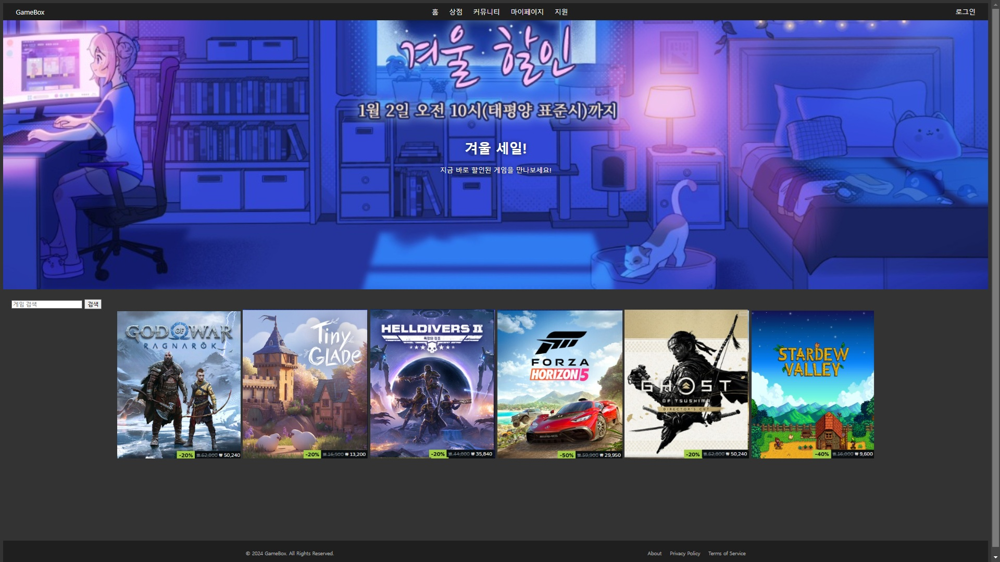

### **2024년 12월 22일 작업 내역**

#### **1. 관리자/회원 기능 분리**

- USERS 테이블에 `role` 칼럼 추가하여 관리자/회원 역할 구분:

  ```sql
  -- 변경된 USERS 테이블
  CREATE TABLE USERS (
      USER_ID NUMBER PRIMARY KEY,                 
      USERNAME VARCHAR2(50) NOT NULL UNIQUE,         
      PASSWORD VARCHAR2(100) NOT NULL,           
      EMAIL VARCHAR2(100) NOT NULL UNIQUE,       
      PROFILE_IMAGE VARCHAR2(200),               
      CREATED_AT TIMESTAMP DEFAULT SYSTIMESTAMP,    
      ROLE VARCHAR2(10) DEFAULT 'USER' NOT NULL CHECK (ROLE IN ('USER', 'ADMIN'))
  );
  ```

- 로그인 시 권한 구분을 위한 기초 작업 완료.

------

#### **2. 페이지 구조 설계**

1. **메인 페이지 분기 설계**:
   - 로그인 후 관리자/일반 사용자 구분.
   - 공통 요소(`header.jsp`, `footer.jsp`)를 include 방식으로 관리.
2. **관리자 페이지 구조**:
   - **회원 관리**: 전체 회원 조회/수정/삭제.
   - **게임 관리**: 게임 CRUD, 가격 설정.
   - **리뷰 관리**: 부적절한 리뷰 삭제.
   - **결제 관리**: 결제 내역 조회.
3. **사용자 페이지 구조**:
   - **게임 목록**: 전체 게임 보기 및 검색.
   - **개인 라이브러리**: 구매한 게임 관리.
   - **리뷰 작성**: 리뷰 작성 및 평점.
   - **커뮤니티**: 사용자 간 상호작용.

------

#### **3. 페이지 파일 생성**

1. **관리자 페이지**:

   ```bash
   admin/
   ├── dashboard.jsp    # 관리자 대시보드
   ├── users.jsp        # 사용자 관리 페이지
   ├── games.jsp        # 게임 관리 페이지
   ├── reviews.jsp      # 리뷰 관리 페이지
   └── payments.jsp     # 결제 관리 페이지
   ```

2. **사용자 페이지**:

   ```bash
   user/
   ├── home.jsp         # 사용자 메인 페이지
   ├── games.jsp        # 게임 목록 페이지
   ├── library.jsp      # 개인 라이브러리
   ├── reviews.jsp      # 리뷰 작성 및 조회
   └── community.jsp    # 커뮤니티 페이지
   ```

3. **공통 파일**:

   ```bash
   common/
   ├── header.jsp       # 공통 헤더
   └── footer.jsp       # 공통 푸터
   ```

4. **메인 페이지**:

   ```bash
   index.jsp            # 전체 메인 페이지
   ```


#### **4. index.jsp페이지 스크린샷**




------

### **이후 작업 계획**

#### **1. 로그인/인증 시스템 구현**

- 로그인 기능:
  - 로그인 페이지 작성 및 DB 연동.
  - 세션 관리 및 권한별 페이지 분리.
  - `USER`와 `ADMIN` 권한에 따라 다른 인터페이스 제공.

#### **2. 검색 시스템 개발**

- 검색 기능:
  - 키워드 기반 검색 기능 구현.
  - DAO에 검색 로직 추가.
  - 검색 결과 UI 개발.

#### **3. 상품 상세 페이지 구현**

- 상세 정보 표시:
  - 게임 이름, 설명, 가격, 이미지 등을 포함한 상세 페이지.
  - 구매 버튼 추가 및 구매 기능 연동.

#### **4. 리뷰/평점 시스템**

- 리뷰 관리:
  - 리뷰 작성, 수정, 삭제 기능.
  - 평점 시스템 추가 및 정렬.

#### **5. 관리자 기능 확장**

- 관리 기능:
  - 게임 등록/수정/삭제.
  - 회원 관리: 회원 비활성화, 삭제.
  - 리뷰 관리: 부적절한 리뷰 삭제 기능.

#### **6. 라이브러리 시스템**

- 구매/보관:
  - 구매 내역 조회.
  - 개인 라이브러리 기능 구현 및 DB 연동.

#### **7. UI/UX 개선**

- 디자인 개선:
  - 반응형 디자인 적용.
  - 사용자 경험 최적화(애니메이션, 버튼 효과 등).

#### **8. 보안 강화**

- 보안 기능:
  - 입력값 검증 및 에러 처리.
  - 비밀번호 암호화.
  - SQL Injection 방지.

#### **9. 배포 준비**

- 배포 작업:
  - 로컬 테스트 후 배포 환경 설정.
  - Replit, Render, 또는 Heroku를 사용해 배포.
  - 사용자 피드백 수집 후 개선 작업 진행.
